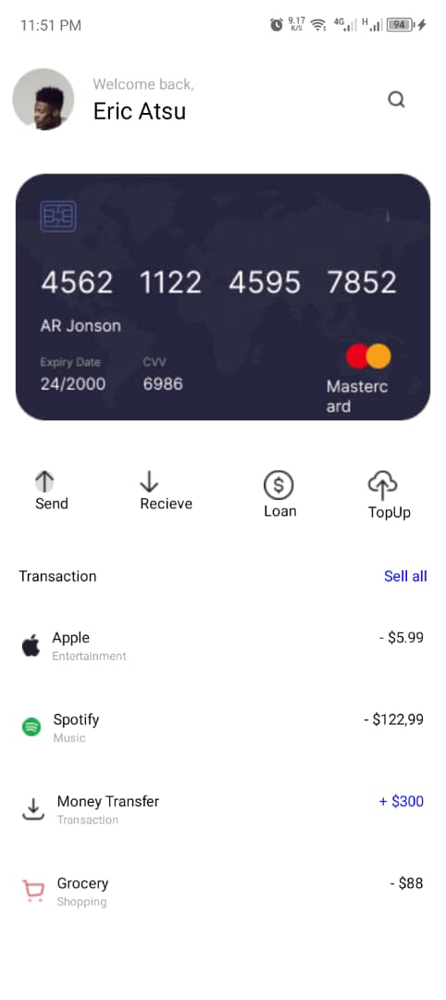

# My Mobile Application

This mobile application was built using React Native, leveraging the `react-navigation` library for navigation and `styled-components` for theming. The app includes several screens such as Home, My Cards, Statistics, and Settings, each with its own unique functionality. The application also supports switching between light and dark themes.

## Features

- **Home Screen:** Displays a welcome message, a debit card image, and transaction details.
- **Settings Screen:** Allows users to change settings, including switching between light and dark themes.

## Screenshots

### Home Screen


### Settings Screen


## Installation and Setup

1. **Clone the repository:**
   ```sh
   git clone https://github.com/tthe-cute-programmer/rn-assignment5-11357247.git
   cd your-repo-name
